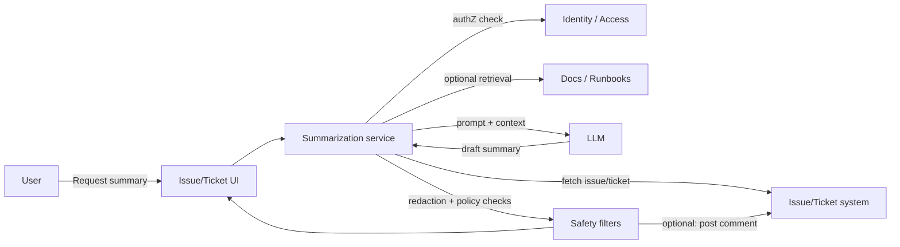

# Work-item summarization assistant (thread + context summaries)

> **SAFE‑AUCA industry reference guide (starter template)**
>
> This use case describes a real-world workflow that many organizations deploy early: summarizing long work-item threads (issues/tickets/incidents) into a structured context snapshot.
>
> It focuses on:
> - how the workflow works in practice (tools, data, trust boundaries, autonomy)
> - what can go wrong (defender-friendly kill chain)
> - how it maps to **SAFE‑MCP techniques**
> - what controls + tests make it safer
>
> **Defender-friendly only:** do **not** include operational exploit steps, payloads, or step-by-step attack instructions.  
> **No sensitive info:** do not include internal hostnames/endpoints, secrets, customer data, non-public incidents, or proprietary details.

---

## Metadata

| Field | Value |
|---|---|
| **SAFE Use Case ID** | `SAFE-UC-0018` |
| **Status** | `draft` |
| **Maturity** | `starter-template` |
| **NAICS 2022** | `51` (Information), `513210` (Software Publishers) |
| **Last updated** | `2026-02-17` |

### Evidence (public links)
- https://support.atlassian.com/jira-service-management-cloud/docs/summarize-an-issues-comments-using-atlassian-intelligence/
- https://docs.github.com/en/copilot/tutorials/explore-issues-and-discussions
- https://help.desk365.io/en/articles/summarize-ticket-using-ai/

---

## Minimum viable write-up (Seed → Draft fast path)

If you’re converting this starter into a stronger draft, aim to complete:
- Executive summary
- Industry context & constraints
- Workflow + scope
- Architecture (tools + trust boundaries + inputs)
- Operating modes
- Kill-chain table
- SAFE‑MCP mapping table (technique IDs may be `TBD` initially)
- Contributors + Version History (add your initial row)

---

## 1. Executive summary (what + why)

**What this workflow does**  
Software and IT teams use “work items” (bugs, feature requests, incident follow-ups, support tickets) as the system of record for ongoing work. Over time, a single item can accumulate:
- long comment threads
- status changes and ownership handoffs
- attachments (screenshots, logs)
- links to other work items, PRs, docs, dashboards, runbooks

A **work-item summarization assistant** generates a short, structured summary of the current state:
- what happened so far
- current status and owner
- key decisions and rationale
- open questions / blockers
- next actions

**Why it matters (business value)**  
This reduces time to:
- get context during handoffs
- re-triage reopened tickets
- prepare status updates
- decide whether escalation is needed

Because it can be deployed **read-only** (no tool writes), it’s often one of the first “agentic” workflows organizations roll out.

**Why it’s risky / what can go wrong**  
Even read-only summarization can fail in high-impact ways:
- **Integrity:** hallucinated or incorrect summaries mislead humans
- **Confidentiality:** summaries can leak sensitive content from tickets (PII, credentials, incident details)
- **Scope:** retrieval expansion (linked tickets/docs/search) can accidentally cross permission boundaries
- **Persistence:** if the assistant auto-posts summaries back into tickets, errors or leakage can spread and persist

---

## 2. Industry context & constraints (reference-guide lens)

Keep this high level (no implementation specifics).

### Where this shows up
Common in:
- SaaS engineering teams (bugs/features/customer issues)
- ITSM/service desks (incidents/requests/problems)
- customer support escalation queues
- security/infra teams (incident threads, reliability follow-ups)

### Typical systems
- ticket/issue trackers (issue fields, comments, history)
- identity and access (SSO, RBAC, groups)
- knowledge bases / runbooks / internal docs
- code hosting links (PRs, commits), dashboards, incident timelines (optional)

### Constraints that matter
- **Access control:** summaries must respect the same permissions as the underlying work item (and any linked objects).
- **Data sensitivity:** tickets often contain secrets, credentials, PII, security incident details, or customer data.
- **Auditability:** teams often need to understand “what source text produced this summary?”
- **Latency:** users expect a summary in seconds.
- **Correctness over creativity:** hallucinations are harmful; faithful summarization is the goal.

### Must-not-fail outcomes
- leaking secrets/PII into a broadly visible summary
- misrepresenting status/owner/commitments in a way that causes incorrect action
- persistent misinformation if auto-posted into the system of record

---

## 3. Workflow description & scope

### 3.1 Workflow steps (happy path)
1. A user views a work item and requests a summary (button, command, or automated trigger).
2. The summarizer fetches the work item: description, comments, metadata, status, timestamps.
3. (Optional) The summarizer retrieves limited related context (linked items, runbooks, docs) within permission scope.
4. The model produces a structured summary.
5. The summary is shown to the user, and optionally:
   - copied into a handoff
   - posted back as a comment (HITL / guarded)
   - written into dedicated fields (“Summary”, “Next steps”) (higher-risk)

### 3.2 In scope / out of scope
- **In scope:** faithful summarization of ticket content and explicitly allowed related context.
- **Out of scope:** executing instructions contained inside ticket text; taking operational actions (deploys, incident remediation) as part of summarization.

### 3.3 Assumptions
- The ticketing system is the authoritative record.
- The summarizer enforces request-scoped authorization checks for any retrieval.
- Model output is treated as untrusted until it passes safety checks (redaction, policy checks).

### 3.4 Success criteria
- Summary is accurate and clearly marked as machine-generated (when applicable).
- No cross-scope leakage (summary reveals only what the requester can access).
- Secrets/PII are redacted or blocked before display/posting.
- Delivered within target latency/SLO and fails safely.

---

## 4. System & agent architecture

### 4.1 Actors and systems
- **Human roles:** engineers, support agents, on-call responders, managers
- **Work-item system:** issue tracker / ticketing system
- **Identity & access:** SSO/RBAC/group membership
- **Summarization service:** the component orchestrating retrieval, prompting, filtering
- **LLM runtime:** internal or hosted model
- **Optional context sources (read-only):** docs/runbooks, code links, dashboards
- **Safety filters:** secret scanning, PII detection/redaction, policy checks

### 4.2 Trusted vs untrusted inputs (high value, keep simple)

| Input/source | Trusted? | Why | Typical failure/abuse pattern | Mitigation theme |
|---|---|---|---|---|
| Ticket comments & descriptions | Untrusted | user-generated | prompt injection / misinformation | treat as data; isolate instructions; structured output |
| Attachments (logs, screenshots) | Untrusted | often external | secrets exposure / irrelevant content | scanning + limits + sandboxing |
| Links in tickets | Untrusted | can be malicious/restricted | retrieval expansion / scope confusion | no direct browsing; strict allowlists |
| Ticket metadata (status/assignee) | Semi-trusted | system-derived but editable | manipulation / stale fields | verify via system APIs; prefer authoritative fields |
| Internal KB/runbooks | Semi-trusted | can be stale | wrong guidance | provenance + “last updated” + citations |
| Tool outputs | Mixed | depends on tool | contaminated context | schema + validation + logging |

### 4.3 Trust boundaries (required)
Key boundaries reviewers should model explicitly:

1) **Untrusted input boundary**  
Ticket text is untrusted data (even if authored by employees). It can contain adversarial instructions, misinformation, or malformed content.

2) **Permission boundary**  
The summarizer must not access or reveal data the requester cannot access (including linked tickets/docs).

3) **Model boundary**  
LLM outputs are probabilistic and should be treated as untrusted until checked.

4) **Write boundary (if enabled)**  
Posting summaries back into the ticket makes model output persistent and shareable; risk increases sharply.

### 4.4 High-level flow (illustrative)

### 4.5 Tool inventory (required)
Typical tools (names vary by platform):

| Tool / MCP server | Read / write? | Permissions | Typical inputs | Typical outputs | Failure modes |
|---|---|---|---|---|---|
| `issue.read` | read | requester-scoped | issue/ticket id | fields, comments, history | over-fetching; missing fields; stale cache |
| `issue.list_comments` | read | requester-scoped | issue id | comment list + ids | ingestion of untrusted content |
| `issue.search` (optional) | read | restricted | query text | matching issues | cross-scope leakage; bulk harvesting |
| `docs.read` (optional) | read | restricted | doc id/url | doc content | stale or incorrect context |
| `issue.comment.create` (optional) | write | gated | issue id + content | created comment id | persistence of hallucination/leakage |
| `issue.field.update` (optional) | write | gated | field + value | updated record | integrity damage; workflow disruption |

### 4.6 Governance & authorization matrix (recommended for draft/published)

| Action category | Example actions | Allowed mode(s) | Approval required? | Required auth | Required logging/evidence |
|---|---|---|---|---|---|
| Read-only retrieval | fetch issue fields/comments | manual/HITL/autonomous | no | requester-scoped token | request + retrieval set |
| Retrieval expansion | fetch linked docs/issues | manual/HITL/autonomous (guarded) | depends | requester-scoped + allowlists | retrieval list + denials |
| Global search | org-wide issue search | manual/HITL only (initially) | yes | elevated scope | query logs + access checks |
| Write back to system | post comment with summary | HITL (initially) | yes | scoped writer role | before/after + attribution |
| Update workflow fields | update status/owner/priority | manual only (recommended) | always | step-up auth | immutable audit trail |

### 4.7 Sensitive data & policy constraints
- **Data classes:** internal-only info, customer PII, credentials/tokens, security incident details, contractual commitments
- **Retention/logging:** keep audit logs while avoiding sensitive-data replication in logs
- **Output policy:** summaries must not reveal secrets/PII; must be faithful to source; must not fabricate citations
- **UI policy:** clearly label machine-generated summaries and provide “view sources” affordances

---

## 5. Operating modes & agentic flow variants

### 5.1 Manual baseline (no agent)
A human reads the issue and writes:
- handoff notes
- status update
- summary for manager/customer

**Risks:** slow and inconsistent; context switching; missed details.

### 5.2 Human-in-the-loop (HITL / sub-autonomous)
The assistant drafts a summary; a human:
- reviews for accuracy
- removes sensitive content
- decides whether to post it back

**Typical UX:** “Summarize” → editable output → “Copy/Insert/Post” actions.

**Risk profile:** mostly bounded to incorrect text if not auto-posted.

### 5.3 Fully autonomous (end-to-end agentic, guardrailed)
Summaries generated automatically on triggers:
- reassigned to a new owner
- reopened after closure
- thread exceeds N messages
- major status transition

Guardrails for autonomy:
- clear “auto-generated draft” labeling
- owner notifications and easy edit/remove
- citations to source comment IDs/timestamps
- default to not posting publicly without explicit enablement

**Risk profile:** higher; persistence makes errors long-lived.

### 5.4 Variants (optional)
A safe pattern is to split into small components:
1. **Collector** (permission-scoped retrieval only)
2. **Summarizer** (structured draft)
3. **Redactor** (secrets/PII policy)
4. **Verifier** (unsupported-claim detection + citation enforcement)

---

## 6. Threat model overview (high-level)

### 6.1 Primary security & safety goals
- prevent cross-scope data leakage
- prevent persistence of sensitive content (especially if posting back)
- minimize hallucinations / unsupported claims
- keep the workflow attributable and auditable

### 6.2 Threat actors (who might attack / misuse)
- malicious external reporter (public bug tracker scenarios)
- compromised employee account
- insider attempting to launder sensitive content into summaries
- compromised/malicious integration or tool output source

### 6.3 Attack surfaces
- user-generated ticket text (comments/descriptions)
- attachments (pasted logs often include secrets)
- links and referenced resources
- retrieval expansion (linked tickets/docs/search)
- write-back actions (posting summaries into system of record)

### 6.4 High-impact failures (include industry harms)
- **Customer/consumer harm:** disclosure of customer info; incorrect commitments communicated or relied upon
- **Business harm:** breach incidents, regulatory exposure, reputational damage, bad prioritization or missed incidents
- **Security harm:** unauthorized access/exfiltration; integrity damage if summaries are persisted and trusted

---

## 7. Kill-chain analysis (stages → likely failure modes)

> Keep this defender-friendly. Describe patterns, not “how to do it.”

| Stage | What can go wrong (pattern) | Likely impact | Notes / preconditions |
|---|---|---|---|
| 1. Entry / trigger | Adversary creates/edits ticket content to influence summarizer | sets up prompt injection or misinformation | external reporter or compromised user |
| 2. Context contamination | Summarizer ingests untrusted thread text without boundaries | model follows instructions inside “data” | treat ticket text as untrusted |
| 3. Retrieval expansion | Agent pulls linked issues/docs beyond requester scope | data exfiltration via summary | common when using global search |
| 4. Generation | Model hallucinates status/owner/decisions | mis-triage, wrong escalation, bad decisions | needs verification + structured format |
| 5. Persistence | Auto-posted summary becomes record and spreads | long-lived misinformation or leakage | higher risk in autonomous mode |
| 6. Feedback loop | Humans trust summary and stop reading source | systemic quality & safety regression | push citations + “view sources” UX |

---

## 8. SAFE‑MCP mapping (kill-chain → techniques → controls → tests)

> Goal: make SAFE‑MCP actionable in this workflow.

| Kill-chain stage | Failure/attack pattern (defender-friendly) | SAFE‑MCP technique(s) | Recommended controls (prevent/detect/recover) | Tests (how to validate) |
|---|---|---|---|---|
| Entry / contamination | Untrusted ticket text steers the model away from summarization | SAFE‑T1102 (Prompt Injection) | treat ticket text as data; strict system instructions; isolate/quote ticket content; structured output schema | adversarial-content fixtures; ensure output remains a summary and policy-compliant |
| Retrieval expansion | Cross-scope leakage via linked items or search | SAFE‑T1309 (Privileged Tool Invocation via Prompt Manipulation); SAFE‑T1801 (Automated Data Harvesting) | requester-scoped auth per retrieval; explicit allowlists; deny global search by default; log retrieval set | attempt to reference restricted objects; confirm refusal/omission; rate-limit/budget tests |
| Generation | Unsupported claims / false status/decisions | SAFE‑T2105 (Disinformation Output) | structured summaries; require citations (comment IDs); verifier step for key claims; “needs review” UI | golden-set eval for factual fields (owner/status/next steps); hallucination thresholds |
| Persistence | Posting summary leaks sensitive info | SAFE‑T1910 (Covert Channel Exfiltration); SAFE‑T1911 (Parameter Exfiltration) | secret/PII scanning before display/post; default to draft-only; approval gate for posting | seed synthetic secrets/PII; verify block/redaction before any write-back |
| Feedback loop | UI hides tool activity or overstates certainty | SAFE‑T1404 (Response Tampering) | show “sources used”; link back to original comments; label machine-generated output; tool ledger binding | UX tests: users can trace claims to sources; audits show tool calls match narrative |

---

## 9. Controls & mitigations (organized)

### 9.1 Prevent (reduce likelihood)
- **Least privilege by default:** start read-only (`issue.read`).
- **Permission-scoped retrieval:** each retrieved object must pass requester authZ.
- **No direct URL browsing from ticket text:** treat links as untrusted; require explicit allowlists.
- **Structured output:** fixed schema to reduce drift and hallucination surface.
- **Citations:** include comment IDs/timestamps for key claims (status/decision/next steps).
- **Redaction:** scan inputs/outputs for secrets and PII; block or redact.

### 9.2 Detect (reduce time-to-detect)
- injection pattern detection on user-generated content (lightweight heuristics + analytics)
- log and alert on blocked/redacted generations
- monitor hallucination and “unsupported claim” rates over time
- anomaly detection on retrieval volume (bulk/iterative patterns)

### 9.3 Recover (reduce blast radius)
- kill switch to disable auto-generation and/or write-back
- easy rollback: delete/replace posted summaries
- user reporting flow (“bad summary”) routed to owners
- degrade safely: if uncertain, show partial summary with explicit “needs review”

---

## 10. Validation & testing plan

### 10.1 What to test (minimum set)
- **Permission boundaries:** different users with different ticket access must get different summaries (no leakage).
- **Prompt/tool-output robustness:** adversarial ticket content does not change system behavior.
- **Secret/PII protection:** synthetic secrets/PII are blocked/redacted in outputs and never written back.
- **Factuality:** key fields (owner, status, decisions, next steps) meet accuracy targets.
- **Reliability:** summaries meet latency SLOs and fail safely.

### 10.2 Test cases (make them concrete)

| Test name | Setup | Input / scenario | Expected outcome | Evidence produced |
|---|---|---|---|---|
| Cross-scope summary | two users w/ different access | summarize same ticket w/ restricted links | outputs differ; no restricted info | logs + output snapshots |
| Injection robustness | adversarial text fixture | ticket contains instruction-like content | still a summary; ignores instructions | fixture + output diff |
| Secret/PII filter | synthetic secret fixtures | ticket contains fake keys/PII | blocked/redacted before display/write | filter logs + outputs |
| Factual fields eval | labeled dataset | run summaries vs ground truth | accuracy above threshold | eval report |
| Write-back gating | HITL enabled | attempt to post summary | requires approval; audit trail | tool logs + change record |

### 10.3 Operational monitoring (production)
- summary request volume, latency, error rate
- blocked/redacted output rate
- retrieval expansion rate (linked docs/issues)
- user feedback signals (“bad summary” reports)
- rollback events / kill-switch activations

---

## 11. Open questions & TODOs

- [ ] Confirm which SAFE‑MCP technique IDs should be the canonical mapping for each stage (if the catalog evolves).
- [ ] Define a standard structured summary schema (fields + citation format) for consistency.
- [ ] Decide policy for attachments (logs/screenshots): summarize vs exclude vs gated.
- [ ] Decide default policy for write-back: disabled by default vs HITL-only.
- [ ] Define minimum audit requirements for regulated environments (retention, provenance).

---

## 12. Questionnaire prompts (for reviewers)

### Workflow realism
- Are the tools and steps realistic for common issue trackers / ITSM tools?
- What major constraint is missing (permissions, attachments, links, latency)?

### Trust boundaries & permissions
- Where are the real trust boundaries?
- Can the summarizer access linked issues/docs? Global search?
- Are tokens request-scoped and short-lived?

### Output safety & persistence
- Is the summary displayed only to the requester, or posted back?
- Do we scan for secrets/PII before showing/posting?
- Is output clearly labeled as machine-generated? Do we show sources?

### Correctness
- What facts must never be wrong (owner, status, SLA timers, commitments)?
- Do we require citations for key claims?
- What is the rollback plan if summaries drift or regress?

### Operations
- Success metrics: time saved, better handoffs, fewer reopen loops
- Danger metrics: leakage incidents, hallucination rate, complaint rate
- Who owns the kill switch?

---

## Appendix (optional)

### A. Suggested summary format
A format that tends to work well:

- **TL;DR (1–2 sentences)**
- **Current status** (state, owner, SLA clock)
- **What changed recently** (last 24–72h)
- **Key decisions** (with citations)
- **Open questions / blockers**
- **Next steps** (with owner + due date if available)

### B. References (optional)
- Additional public evidence links

---

## Contributors

- **Author:** SAFE‑AUCA community (update with name/handle)
- **Reviewer(s):** TBD
- **Additional contributors:** TBD

---

## Version History

| Version | Date | Changes | Author |
|---|---|---|---|
| 1.0 | 2026-02-15 | Rewritten to align with latest SAFE‑AUCA template; retains starter content and adds governance/inputs/versioning sections | SAFE‑AUCA community |
